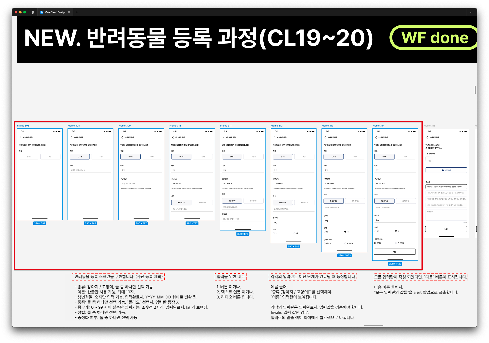

```
createdAt: 2024-08-18
author: @smnchoi
```

# 과제 설명

1. Expo 를 사용해서 jobs/2-10 경로에 React Native 앱을 만들어 보세요. 앱의 이름은 `{깃헙username}` 입니다. 즉, `{깃헙username}` 이 smnchoi 라면, jobs/2-10/smnchoi 경로에 앱이 있어야 합니다.

2. [이미지](assignment-rn-forms.png)를 참고하여, 스크린을 구현하세요.



3. 자세한 디자인 스펙은 Figma 를 통해 참고하세요.

# 기타

답안을 완성하고 나면, PR 을 생성한 뒤 디스코드 DM 을 통해 메시지 주세요. 이후, 코드 리뷰를 진행합니다.
